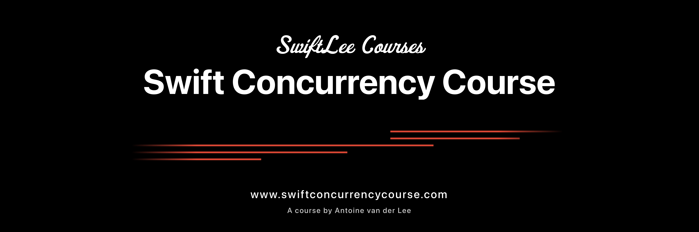

# Swift Concurrency Course - Sample Code

## 📖 About This Repository

This repository contains code samples and exercises that accompany the **Swift Concurrency Course**, which helps developers transition from Grand Central Dispatch (GCD) to Swift’s modern concurrency model, introduced in **Swift 5.5** and improved in **Swift 6**.

The course is available at [swiftconcurrencycourse.com](https://www.swiftconcurrencycourse.com).

## 🎯 Course Overview

The course covers:

- The **async/await** syntax and how it simplifies asynchronous code.
- Structured concurrency with **Task** and **TaskGroup**.
- The **MainActor** and handling UI updates safely.
- Managing concurrency with **actors**.
- Using **continuations** to bridge existing completion handlers.
- Migration strategies from GCD to Swift Concurrency.
- Performance optimizations and debugging.

And much more. You can find the complete course curriculum at [swiftconcurrencycourse.com](https://www.swiftconcurrencycourse.com).

## 🛠️ How to Use

1. Clone the repository
2. Open the **Sample Code** folder to access code samples per module.
3. Follow along with the course for in-depth explanations, exercises, and code explanations.

## 📌 Recommended setup

- **Xcode 16 and up**
- **macOS 15 and up**

## 🚀 Contributing

Contributions are welcome! 

If you find issues or have improvements, feel free to open a pull request or an issue. I'll be using these to improve the course along the way.

## 📢 Stay Updated
If you've purchased the course, there's nothing else to do. I'll frequently update you via email when new course updates arrive. 

Yet, to make the most out of your learning experience, I recommend:

- Following me on [Twitter/X](https://twitter.com/twannl), [Bluesky](https://bsky.app/profile/avanderlee.com), and/or [LinkedIn](https://www.linkedin.com/in/ajvanderlee/) for updates.
- Subscribe to [SwiftLee Weekly](https://swiftlee.com/newsletter/) for Swift, SwiftUI, and Swift Evolution-related news.

## 📜 License

This project is licensed under the **MIT License**—see the [LICENSE](LICENSE) file for details. Feel free to use the code examples in your projects.
